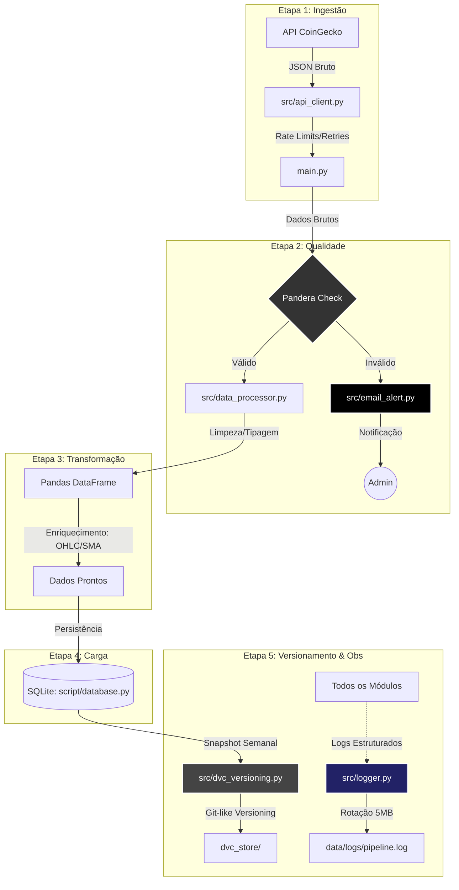
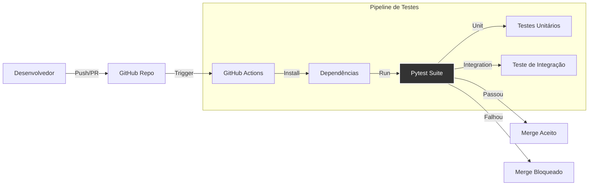

# Plataforma de Análise de Dados de Criptomoedas (MLOps)

## Visão Geral

Este projeto foi desenvolvido visando aplicar **conhecimentos de Engenharia de Dados e MLOps** no contexto do mercado de criptomoedas. Esta solução buscou integrar o início de um Pipeline de Dados: iniciando pela ingestão de dados (Real-time & Batch), passando pelo processamento estruturado, armazenamento persistente, e chegando ao versionamento de dados.

Automatizado para rodar 24/7, ele fornece dados contínuos sobre o mercado cripto, servindo como fundação para futuros modelos de Machine Learning e dashboards de visualização.

## Arquitetura da Solução

A arquitetura segue o padrão **ETL (Extract, Transform, Load)** focado em robustez e auditabilidade. Abaixo, a relação entre os módulos do projeto e suas camadas:

```text
/
├── Orquestração & Configuração
│   ├── main.py                 # [Orquestrador] Entrypoint CLI
│   ├── pyproject.toml          # [Config] Dependências e Ferramentas (PEP 621)
│   └── .github/workflows/      # [CI/CD] Pipeline de Testes Automatizados
│
├── Ingestão (Extract)
│   └── src/api_client.py       # Wrapper da API CoinGecko (Resiliência e Retries)
│
├── Processamento & Qualidade (Transform)
│   ├── src/data_processor.py   # Lógica de Limpeza, Tipagem e Enriquecimento (OHLC)
│   └── src/schemas.py          # Contratos de Dados (Pandera) - Bloqueio de Falhas
│
├── Armazenamento (Load)
│   ├── src/database.py         # DAO SQLite (Persistência Relacional)
│   └── data/cripto.db          # Banco de Dados (Versionado via DVC)
│
├── Governança & Ops
│   ├── src/dvc_versioning.py   # Versionamento de Dados (Snapshots DVC)
│   ├── src/email_alert.py      # Monitoramento e Alertas de Falha
│   ├── src/logger.py           # [Observabilidade] Configuração Central de Logs
│   └── data/logs/              # [Logs] Arquivos rotativos de execução
│
└── Testes (QA)
    ├── tests/unit/             # Testes Unitários Isolados (Mocks)
    │   ├── test_api_client.py
    │   ├── test_data_processor.py
    │   ├── test_database.py
    │   ├── test_schemas.py
    │   ├── test_email_alert.py
    │   └── test_dvc_versioning.py
    └── tests/integration/      # Testes End-to-End
        └── test_pipeline_flow.py
```

**Fluxograma de Dados (Data Flow):**




**Explicação detalhada do fluxo de dados:**

1.  **Ingestão (`src/api_client.py` → `main.py`)**:

    *   Embora seja o `main.py` quem invoque o cliente, o dado (JSON bruto) sai da API, passa pelo Client (que trata retries/erros) e é retornado para o `main.py`.

    *   Nesse momento, o `main.py` segura a "batata quente" (o dado bruto) na memória.

2.  **Qualidade (`main.py` → `Pandera Check`)**:
    *   O `main.py` (Orquestrador) pega esse dado bruto e o envia para a etapa de Processamento.
    *   A validação do **Pandera** age como um "porteiro" ou "filtro de segurança" logo na entrada dessa etapa. Antes que o dado seja transformado ou limpo, ele é validado. Se inválido, o fluxo é interrompido e o `src/email_alert.py` é acionado.

3.  **Processamento (`Pandera` → `src/data_processor.py`)**:
    *   Apenas dados validados entram aqui. O processador realiza a limpeza, tipagem (Pandas) e enriquecimento (cálculo de médias móveis, OHLC).
    *   O resultado é um DataFrame estruturado pronto para carga.

4.  **Carga (`Processor` → `SQLite`)**:
    *   O `main.py` recebe o DataFrame tratado e utiliza o `src/database.py` para persistir os registros no banco de dados local.

6.  **Observabilidade (`Todos` → `Logger`)**:
    *   Toda operação crítica (conexão, validação, inserção, erro) é registrada via `src/logger.py`.
    *   Logs são rotacionados para não encher o disco e permitem auditoria de falhas passadas.


**Fluxograma de Chamadas de Funções (Call Graph):**


**Explicação detalhada do fluxo de chamada de funções:**

*   **Orquestração Central**: O `main.py` é o "chefe". Ele chama ativamente os outros módulos.
*   **Sequência de Execução**:
    1.  `main.py` chama `api_client.get_top_cryptocurrencies()`.
    2.  `main.py` passa o retorno para `data_processor.process_market_data()`.
    3.  Dentro do processador, a função chama `MarketDataSchema.validate()`.
    4.  Se aprovado, `main.py` recebe o DF e chama `database.insert_dataframe()`.
*   **Assincronicidade**: O `dvc_versioning.py` **não** é chamado pelo `main.py`. Ele é disparado independentemente pelo Sistema Operacional (Cron), demonstrando o desacoplamento entre Operação (Ingestão) e Governança (Backup/Versionamento).

## Funcionalidades Principais

### 1. Ingestão Híbrida Inteligente (`main.py`)
- **Modo Real-Time**: Captura o estado atual do mercado (Top 250 moedas) via `crontab` (3x/dia).
### 1. Ingestão Híbrida Inteligente (`main.py`)
- **Modo Real-Time**: Captura o estado atual do mercado (Top 250 moedas) via `crontab` (3x/dia).
- **Modo Histórico**: Capacidade de *backfill* de dados passados (configurável, ex: 365 dias) com controle inteligente de limites da API.

### 2. Resiliência e Monitoramento (`src/email_alert.py`)

- **Alerta de Falha**: O pipeline monitora sua própria execução. Caso a coleta retorne 0 registros, um alerta crítico é disparado por e-mail para o administrador.

### 3. Versionamento de Dados (`src/dvc_versioning.py`)
- **DVC (Data Version Control)**: Implementação profissional de versionamento em substituição a backups manuais.
    - O banco de dados `cripto.db` é rastreado como um artefato.
    - Scripts automatizados geram snapshots semanais.
    - Histórico armazenado em remote local (`dvc_store/`).

### 4. Qualidade de Dados (Pandera)
- **Data Contracts**: Validação rigorosa dos dados de entrada (`src/schemas.py`).
- **Bloqueio de Dados Sujos**: O pipeline é interrompido imediatamente se dados inválidos (ex: preços negativos) forem detectados, protegendo a integridade do banco.

### 5. Logging Estruturado & Observabilidade (`src/logger.py`)
- **Rastreabilidade**: Substituição de `prints` por logs padronizados (`[DATA] [MODULO] [NIVEL] Msg`).
- **Arquivos Rotativos**: Logs salvos em `data/logs/pipeline.log` com rotação automática (5 arquivos de 5MB), evitando consumo excessivo de disco.
- **Níveis de Log**: Uso correto de INFO (fluxo normal), WARNING (retries/dados vazios) e ERROR (falhas de conexão/schema).

### 6. Arquitetura de Testes e CI/CD

Garantimos a estabilidade do sistema através de uma suíte de testes automatizados e Integração Contínua (CI).

**Fluxo de Testes (Test Workflow):**




**Documentação dos Testes (`tests/`):**

| Tipo | Arquivo | Descrição |
| :--- | :--- | :--- |
| **Unitário** | `test_api_client.py` | Simula respostas da API (200, 429, Timeout) para validar resiliência do cliente. |
| **Unitário** | `test_data_processor.py` | Valida limpeza de dados, conversão de tipos e cálculos financeiros (Volatilidade/OHLC). |
| **Unitário** | `test_database.py` | Testa criação de tabelas, inserção de dados e integridade (UNIQUE constraints) em banco temporário. |
| **Unitário** | `test_schemas.py` | Garante que o Pandera bloqueie dados inválidos (ex: preços negativos) e aprove dados corretos. |
| **Unitário** | `test_email_alert.py` | Verifica se o sistema tenta enviar e-mail e faz fallback para log em caso de erro, sem spam real. |
| **Unitário** | `test_dvc_versioning.py` | Testa a lógica dos comandos DVC (add/push) isolando os subprocessos do sistema. |
| **Integração**| `test_pipeline_flow.py` | Simula o ciclo completo: Dados Mock -> Processador Real -> Banco SQLite Real. |

**GitHub Actions (CI/CD):**

O arquivo `.github/workflows/ci.yml` define o pipeline que roda a cada `push`. Ele:
1. Sobe máquinas Ubuntu.
2. Instala Python 3.10 e 3.11.
3. Instala dependências (`pip install .[dev]`).

## Guia de Instalação e Execução

### Pré-requisitos

- Python 3.10+
- Ambiente Virtual
- DVC

### 1. Configuração

```bash
git clone <URL_REPO>
cd Roadmap_MLops
python3 -m venv .venv
source .venv/bin/activate
# Instale as dependências (via pyproject.toml)
pip install -e .

# Ou via legacy requirement:
# pip install -r requirements.txt

# Inicialize o DVC (caso esteja clonando pela primeira vez sem os dados)
dvc pull
```

### 2. Pipeline e Alertas (Opcional)

Para receber alertas por e-mail:
```bash
export EMAIL_USER="seu_email@gmail.com"
export EMAIL_PASSWORD="sua_senha_de_app"
```

**Execução:**
```bash
# Histórico
python main.py --historical --days 365 --all

# Tempo Real
python main.py --all
```

**Versionamento:**
```bash
python src/dvc_versioning.py
```

## Próximos Passos (Roadmap)
- [ ] **Dockerização**: Containerizar a aplicação.
- [ ] **Data Quality**: Great Expectations.
- [ ] **Cloud**: S3 Remote e Postgres.
 
